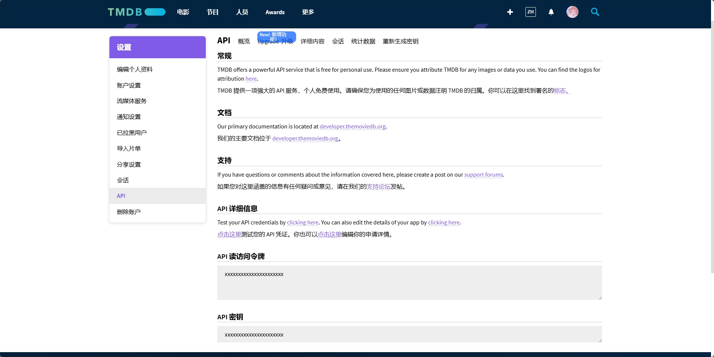
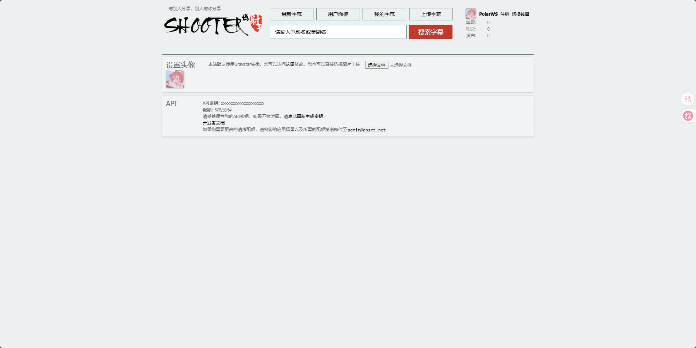

## API Key 获取指南（TMDB / Assrt）

ZongziBay 需要依赖 TMDB 和 Assrt 这两个第三方服务来获取影片信息和字幕。  
在使用前，你需要先到官方站点申请对应的 API Key / Token。

---

## 一、TMDB API Key（影片信息、海报）

ZongziBay 使用 [TMDB (The Movie Database)](https://www.themoviedb.org/) 来获取电影/剧集的名称、简介、海报等元数据。

### 1. 注册 TMDB 账号

1. 打开浏览器访问 TMDB 官网：  
   `https://www.themoviedb.org/`
2. 点击右上角 **Sign Up / 注册**，使用邮箱创建一个账户
3. 完成邮箱验证（TMDB 会发一封确认邮件）

### 2. 申请 API Key

1. 登录 TMDB 后，进入右上角头像菜单，选择 **Settings / 设置**
2. 在左侧菜单中找到 **API** 选项
3. 点击 **Create / 请求 API Key**（如果已经创建过，会直接显示现有的 Key）
4. 按页面提示填写基本信息（使用用途可以简单填写为「ZongziBay 本地媒体管理」）
5. 提交后，即可在同一页面看到你的 **API Key（API 密钥）**

### 3. 在 ZongziBay 中填写

拿到 TMDB API Key 后，回到 ZongziBay：

- 在 Web 设置页中找到 **TMDB 配置**，将 Key 填入对应输入框
- 语言建议设置为：`zh-CN`

保存后，搜索影片或查看详情时，就可以加载到 TMDB 的封面和简介了。

---

## 二、Assrt Token（字幕搜索与下载）

ZongziBay 使用 [Assrt（射手网伪）](https://assrt.net/) 来搜索并下载字幕。

### 1. 注册 Assrt 账号

1. 打开 Assrt 官网：  
   `https://secure.assrt.net/user/logon.xml`
2. **注册 / 登录**，用邮箱创建一个账户
3. 完成邮箱验证或站内要求的激活步骤

### 2. 获取 API Token

1. 登录后，进入个人中心：
   `https://secure.assrt.net/usercp.php`
2. 找到**API** 中的 **API密钥** 复制相关的密钥

### 3. 在 ZongziBay 中填写

拿到 Assrt Token 后，回到 ZongziBay：

- 在 Web 设置页中找到 **字幕 / Assrt 设置**
- 将 Token 填入 `token` 字段
- `base_url` 一般保持默认：`https://api.assrt.net`

保存后，ZongziBay 就可以在整理任务或字幕任务中自动调用 Assrt 搜索并下载字幕。

#### 获取完成后可回到《[ZongziBay 项目使用教程](usage_guide.md)》