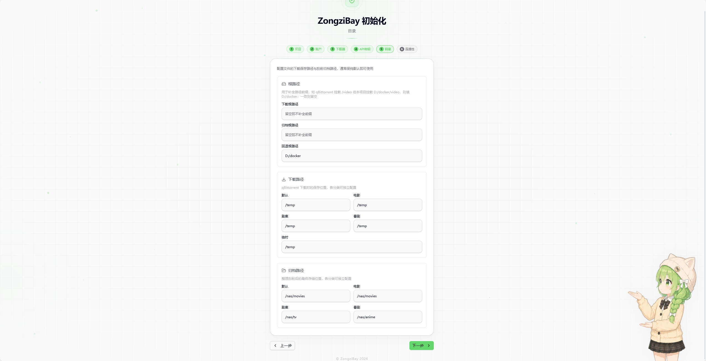

## ZongziBay 项目使用教程

本文档面向「直接想用」的用户，教你使用 **Docker 镜像** `polarws/zongzibay:latest` 一步启动服务，并在 Web 设置页完成后续配置。

---

## 一、准备工作

- **已安装 Docker**
  - Linux / macOS：安装 Docker Engine 或 Docker Desktop
  - Windows：建议安装 Docker Desktop（启用 WSL2）
- **已运行 qBittorrent**（稍后在设置页填地址和账号即可）
- **已准备好 TMDB / Assrt 等 Key、Token**  
  获取方式见《[API Key 获取指南](api_keys_guide.md)》。

---

## 二、拉取镜像

```bash
docker pull polarws/zongzibay:latest
```

---

## 三、启动服务（最简命令）

你只需要把容器的 `8000` 端口映射出来即可，其他配置都可以在 Web 页面里完成。

#### 1. 基本启动命令

```bash
docker run -d \
  --name ZongziBay \
  -p 8000:8000 \
  -v /保存项目配置的路径:/app/config \
  -v /保存视频的路径:/与qBittorrent一致(这里可以写多个) \
  polarws/zongzibay:latest
```

#### 2. 完整示例

```bash
docker run -d \
  --name ZongziBay \
  -p 8000:8000 \
  -v /config:/app/config \
  -v /video:/video \
  -v /temp:/temp \
  polarws/zongzibay:latest
```

对应的 qBittorrent 目录挂载应保持一致，例如：

```bash
  -v /video:/video \
  -v /temp:/temp \
```

---

## 四、访问 Web 界面

容器启动成功后，浏览器访问（localhost改成你的地址）：

- `http://localhost:8000` —— ZongziBay Web 界面

---

## 五、在 Web 设置页完成配置

### 1. 引导页面

首次进入，系统会直接进入引导页设置，你需要根据引导页去配置各项内容，以下是注意事项

- 修改登录的账号、密码、JWT 密钥
- 填写 qBittorrent 的账号、密码
- TMDB：用于影片海报、简介等元数据，填写 API Key
- Assrt：用于字幕自动搜索与下载，填写你的 Token
- 《[API Key 获取指南（TMDB / Assrt）](api_keys_guide.md)》
- 需要你**指定下载目录**，以及电影 / 剧集 / 动漫的归档目录
- 确保这些路径同时对 qBittorrent 和 ZongziBay 可访问



填写完成后请自行点击最后一步的 **「开始测试」按钮进行测试** ，确保连接成功


### 1. 其他设置
如果需要进行其他的设置，设置页面由此进入


配置完成后，就可以在页面里搜索资源、下发到 qBittorrent、查看进度，并享受自动整理和字幕下载功能。
