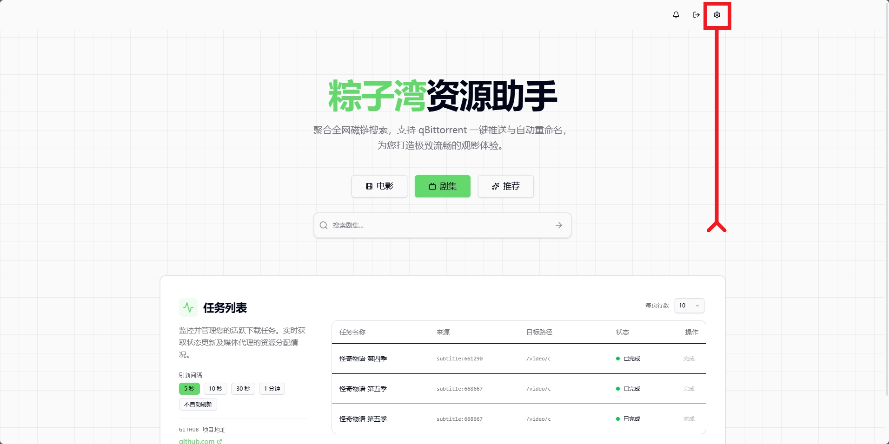
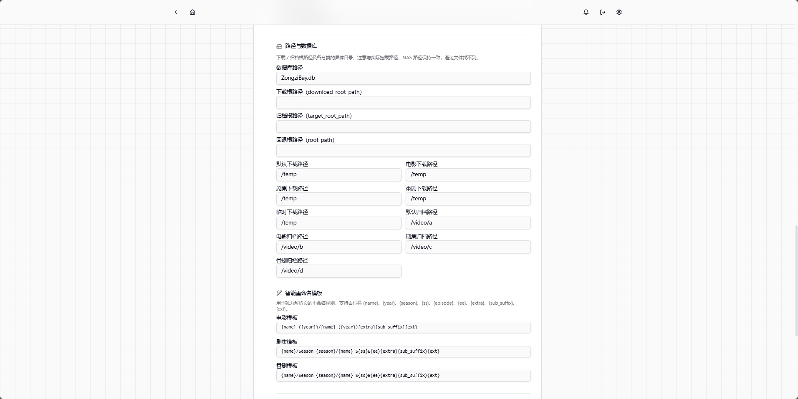

## ZongziBay 项目使用教程

本文档面向「直接想用」的用户，教你使用 **Docker 镜像** `polarws/zongzibay:latest` 一步启动服务，并在 Web 设置页完成后续配置。

---

## 一、准备工作

- **已安装 Docker**
  - Linux / macOS：安装 Docker Engine 或 Docker Desktop
  - Windows：建议安装 Docker Desktop（启用 WSL2）
- **已运行 qBittorrent**（稍后在设置页填地址和账号即可）
- **已准备好 TMDB / Assrt 等 Key、Token**  
  获取方式见《[API Key 获取指南](api_keys_guide.md)》。

---

## 二、拉取镜像

```bash
docker pull polarws/zongzibay:latest
```

---

## 三、启动服务（最简命令）

你只需要把容器的 `8000` 端口映射出来即可，其他配置都可以在 Web 页面里完成。

#### 1. 基本启动命令

```bash
docker run -d \
  --name ZongziBay \
  -p 8000:8000 \
  -v /保存项目配置的路径:/app/config \
  -v /保存视频的路径:/与qBittorrent一致(这里可以写多个) \
  polarws/zongzibay:latest
```

#### 2. 完整示例

```bash
docker run -d \
  --name ZongziBay \
  -p 8000:8000 \
  -v /config:/app/config \
  -v /video:/video \
  -v /temp:/temp \
  polarws/zongzibay:latest
```

对应的 qBittorrent 目录挂载应保持一致，例如：

```bash
  -v /video:/video \
  -v /temp:/temp \
```

---

## 四、访问 Web 界面

容器启动成功后，浏览器访问（localhost改成你的地址）：

- `http://localhost:8000` —— ZongziBay Web 界面

初始登录账号（可在设置页或配置文件中修改）：

- 用户名：`admin`
- 密码：`password123`

**强烈建议：** 第一次登录后，先在设置里修改密码。

---

## 五、在 Web 设置页完成配置

### 1. 登录设置页

- 用上面的默认账号登录
- 进入「设置」页面



### 2. 配置 qBittorrent / TMDB / Assrt

- 《[API Key 获取指南（TMDB / Assrt）](api_keys_guide.md)》
- 修改登录的账号、密码、JWT 密钥
- 填写 qBittorrent 的账号、密码
- TMDB：用于影片海报、简介等元数据，填写 API Key
- Assrt：用于字幕自动搜索与下载，填写你的 Token
- 填写完成后请自行点击最上方的 **「测试全部」按钮进行测试** ，确保连接成功

### 3. 配置路径与整理规则

- 需要你在**设置里指定下载目录**，以及电影 / 剧集 / 动漫的归档目录
- 确保这些路径同时对 qBittorrent 和 ZongziBay 可访问
- 根据需要调整智能重命名模板，让整理后的文件夹结构符合你的习惯



配置完成后，就可以在页面里搜索资源、下发到 qBittorrent、查看进度，并享受自动整理和字幕下载功能。
